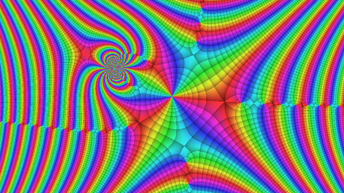

<!-- README.md is generated from README.Rmd. Please edit that file -->

# viscomplexr

<!-- badges: start -->

<!-- badges: end -->

With viscomplexr you can create phase portraits of functions on the
complex number plane. While the main purpose of this package are
scientific, educational and technical applications, the sheer beauty of
phase portraits may be motivation enough to explore the realm
complex-valued functions. The package works in the framework of R base
graphics and allows for print quality graphics files. To a great deal,
the package follows the conventions published by Wegert (2012).

## Installation

Hopefully soon you will be able to install the released version of
viscomplexr from [CRAN](https://CRAN.R-project.org) with:

``` r
install.packages("viscomplexr")
```

And the development version from [GitHub](https://github.com/) with:

``` r
# install.packages("devtools")
devtools::install_github("PeterBiber/viscomplexr")
```

## Example

Let’s plot a phase portrait of the function f(z)=sin(z^3/(z-1i+2)):

``` r
# Make a phase portrait of the function 
# f(z) = sin(z^3/(z - 1i + 2))
# in the domain [-6, 6] (real), and [-3.375, 3.375] (imaginary)

library(viscomplexr)

# reduce plot margin to 0, store previous graphics parameter settings in op
op <- par(mar = c(0, 0, 0, 0))
# call the function phasePortrait
phasePortrait("sin(z^3/(z - 1i + 2))",                   # define the function
              xlim = c(-6, 6), ylim = c(-3.375, 3.375),  # define the domain
              axes = FALSE,                              # suppress axes
              xaxs = "i", yaxs = "i")              # no empty zone around plot
# set graphics parameters to previous values
par(op)
```



<!--
What is special about using `README.Rmd` instead of just `README.md`? You can include R chunks like so:


```r
# summary(cars)
```

You'll still need to render `README.Rmd` regularly, to keep `README.md` up-to-date.

You can also embed plots, for example:


In that case, don't forget to commit and push the resulting figure files, so they display on GitHub!
-->

## References

<div id="refs" class="references">

<div id="ref-wegert_visualcpx_2012">

Wegert, Elias. 2012. *Visual Complex Functions. An Introduction with
Phase Portraits*. Basel Heidelberg New York Dordrecht London: Springer.

</div>

</div>
